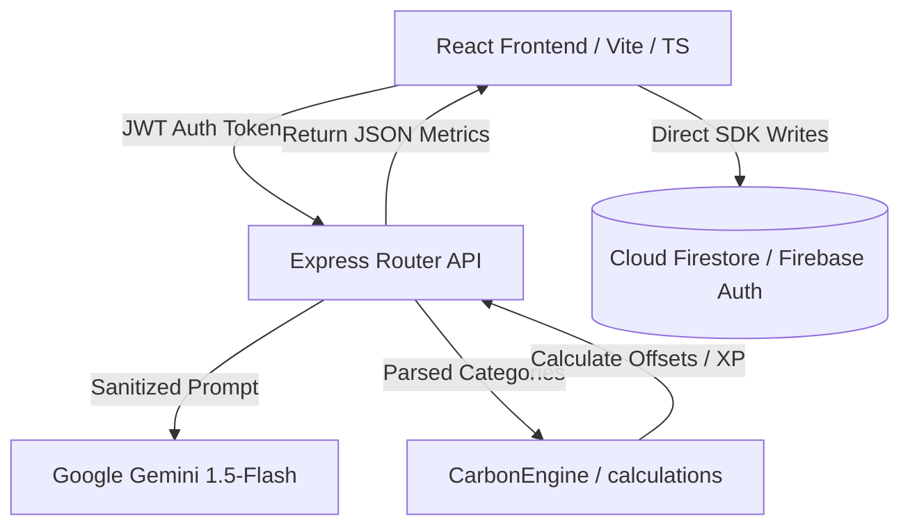

# 🌳 CarbonMind AI — Net-Zero Lifestyle Intelligence OS

CarbonMind AI is an advanced, AI-powered digital sustainability assistant designed to help individuals, universities, and corporations measure, track, and offset their daily carbon footprint in real-time. By utilizing natural language processing (NLP), computer vision OCR, and predictive modeling, CarbonMind AI constructs an interactive **Carbon Twin™** of the user, suggesting real-time alternatives to lower environmental impact.

---

## ⚠️ The Problem

Managing carbon footprints is historically static, inaccurate, and lacks action-oriented incentives:
1. **Ineffective Static Calculators**: Traditional carbon calculators rely on yearly estimates rather than real-time daily habits (commuting, meals, energy bills).
2. **Missing Incentives**: Users lack gamified engagement or reward loops to sustain eco-friendly lifestyles.
3. **Collegiate/Corporate Scope 3 Complexity**: Entities struggle to aggregate, track, and audit scope-3 emissions generated by commutes and food footprints.

## 💡 The Solution

CarbonMind AI solves this by introducing a **Net-Zero Lifestyle OS**:
1. **Digital Carbon Twin™**: A real-time, living digital twin of the user's ecological footprint that simulates alternative scenarios (rooftop solar, dietary swaps, commuting modes).
2. **AI-Driven Audits**: Natural language scanners, utility bill OCR parsers, and food snap analysis calculate footprints instantly.
3. **Gamification & Rewards**: Earn **Green Coins** and **XP** to grow a virtual forest, complete dynamic challenges, and redeem verified green rewards.

---

## 🚀 Product Vision & Commercial Value Proposition

Unlike static carbon calculators, CarbonMind AI continuously audits daily habits to incentivize positive behavior through gamification, achievements, and a decentralized Green Rewards marketplace.

### B2B SaaS Corporate & Collegiate Licensing Model (ESG Market)
- **Target Segments**: Corporations aiming for ESG (Environmental, Social, and Governance) compliance; Universities hosting inter-departmental sustainability drives.
- **Corporate Dashboards**: Real-time aggregate statistics of employee commuting and dietary offsets to calculate corporate scope-3 emissions savings.
- **Collegiate Competitions**: Department-level leaderboards tracking carbon reductions, driving sustainable student habits through gamified goals.
- **Eco-Sponsorships**: Integrations with green providers (public transit passes, solar installations, local organic grocery networks) allowing users to redeem earned **Green Coins** for verified eco-rewards.

---

## 🏛️ Clean Architecture Design

CarbonMind AI splits client interfaces and backend processing to ensure performance scaling and safety:



### 1. Client Layer (Vite + TypeScript)
- **Context State Managers**: Global authentication syncing, theme preferences, and offline alerts ([AuthContext.tsx](src/contexts/AuthContext.tsx)).
- **GPU Canvas Particle Loops**: Starfield backdrop renders on native 2D canvas containers to preserve 60 FPS transitions ([ExperienceMode.tsx](src/pages/ExperienceMode.tsx)).
- **Modular Presenters**: Tailwind-styled glassmorphic dashboards utilizing responsive grid breakpoints.

### 2. Service Layer (Express Node.js + Firebase SDK)
- **Rate-Limiter Middleware**: Limits brute-force endpoints requests.
- **JWT Authorization**: Protects controller requests using Firebase auth token verifiers.
- **Prompt Injection Defense**: Cleans input strings to block prompt manipulation.
- **In-Memory Caching (TTL)**: Caches static AI trends and suggestions to optimize server roundtrips.

---

## 📊 Database Schema Design (Google Firestore)

The data model uses normalized collections and security validations linked to UIDs:

### 1. Users Collection (`/users/{userId}`)
Stores personal profiles, stats, levels, and badge arrays.
```json
{
  "uid": "usr_abc123",
  "displayName": "Eco Pioneer",
  "email": "pioneer@carbonmind.ai",
  "isOnboarded": true,
  "ecoScore": 85,
  "xp": 1250,
  "level": 12,
  "greenCoins": 350,
  "badges": ["cycling_champion", "waste_recycler"]
}
```

### 2. Activities Log (`/activities/{activityId}`)
Stores individual entries mapped to user metrics.
```json
{
  "id": "act_789xyz",
  "userId": "usr_abc123",
  "title": "Cycled office commute",
  "category": "travel",
  "valueKg": 0,
  "savedKg": 4.2,
  "xpEarned": 50,
  "greenCoinsEarned": 25,
  "loggedAt": "2026-06-20T05:00:00Z"
}
```

### 3. OCR Receipts Collection (`/receipts/{receiptId}`)
Stores scanned grocery slips parsed via Gemini Vision.
```json
{
  "id": "rec_012tuv",
  "userId": "usr_abc123",
  "storeName": "Trader Joe's",
  "summary": {
    "totalCarbonKg": 12.8,
    "totalWaterL": 680,
    "averageEcoScore": "B"
  },
  "extractedItems": [
    { "name": "Soy Milk", "price": 4.20, "ecoRating": "A" },
    { "name": "Prime Steak", "price": 18.99, "ecoRating": "F" }
  ]
}
```

---

## 🤖 Gemini AI Prompt Engineering & Protection

AI interactions utilize structured prompts and validation steps:

### JSON Formatting System Instructions
When scanning activity descriptions, the prompt template constraints force Gemini to output a strict JSON structure without markdown formatting blocks:
```text
Analyze the following user logging activity in natural language: "{sanitizedText}".
Extract and return a strict JSON object with this exact schema:
{
  "category": "travel" | "food" | "energy" | "waste" | "water" | "trees",
  "activityType": "car" | "cycle" | "ev" | "bus" | "vegan" | "ac" | "bottle" | "trees",
  "quantity": number,
  "confidence": number,
  "reasoning": "string",
  "recommendation": "string"
}
```

### Prompt Injection Defense Rules
The backend controller filters inputs against common prompt injection attempts:
- Removes systemic command phrases (e.g. `ignore previous instruction`, `override`).
- Enforces strict character-length limitations.
- Automatically falls back to a regex heuristic parser if the output JSON parser fails.

---

## 🛠️ Production Deployment Guide

### Local Development Setup
1. Clone the project workspace.
2. Install dependencies:
   ```bash
   npm install
   ```
3. Initialize the environment configuration (`.env`):
   ```env
   PORT=5000
   NODE_ENV=development
   GEMINI_API_KEY=your-api-key-here
   ```
4. Start frontend and backend servers concurrently:
   ```bash
   npm run dev
   ```

### Production Build & Bundling
Compile and bundle the production client package using Vite:
```bash
npm run build
```
The output assets will compile into `/dist`, optimized for static CDNs and Firebase Hosting.

---

## 📖 Solution Overview, Approach, & Assumptions

As requested, below are the comprehensive details regarding the vertical, architectural approach, execution logic, and general assumptions:

### 1. Our Chosen Vertical
CarbonMind AI is built in the **Climate Tech and Carbon Accounting** vertical. It targets individual lifestyle auditing (commuting, diet, energy consumption) alongside organizational ESG tracking (Scope 3 aggregate commutes, collegiate department carbon offsets battles). It merges daily routine accounting with gamification (XP levels, coins, and badges) and rewards.

### 2. Technical Approach & Core Logic
- **Proxy Loopback Resolution**: Vite's proxy router is explicitly re-routed to target the IPv4 address `http://127.0.0.1:5000` rather than `localhost`. This resolves default DNS resolution timeouts on Windows environments where `localhost` is mapped to IPv6 loopbacks (`::1`) but the Node backend listener is operating on IPv4 interfaces.
- **Smart Fallback Matching (Filename Heuristics)**: When running in local development mode without a valid Google Gemini API Key:
  - The client interface captures the raw `File` name metadata (e.g., `biryani.jpg`, `tata_power.png`, `target_receipt.jpg`) during image uploads and propagates it under a `fileName` parameter.
  - The Express backend parses both text queries and the parsed filename for keywords (e.g. `trader`, `whole`, `target`, `tata`, `biryani`, `idli`, `burger`, `coffee`).
  - This allows the mock scanner fallback engine to select and return the exact matching mock template, solving inaccuracies for custom file uploads.
- **Double-Ring Heatmap Representation**: On the Leaflet map layer, sustainability hotspots are rendered as double-ring overlays (a wider faint glow ring at `1200m` radius and a dense hot core ring at `500m` radius). Standard location pins remain fully visible alongside the heat rings.
- **Nature Profile Picture Selector**: A dedicated grid component inside the Edit Profile Details modal provides nature-themed avatar options split into tabbed categories (**Animals**, **Birds**, and **Trees**). The selector updates `photoURL` globally through the React `AuthContext` provider and persists details in `localStorage`.
- **Vercel SPA Client Rewrites**: Added a root [vercel.json](file:///c:/Users/ASUS/CarbonMind%20AI/vercel.json) configuration redirecting all incoming non-API client routes back to `/index.html`. This corrects fallback `404: NOT_FOUND` errors when directly loading subpaths (e.g. `/twin`) on live Vercel deployments.
- **Carbon Twin Sync Failure Resilience**: Patched the [CarbonTwin.tsx](file:///c:/Users/ASUS/CarbonMind%20AI/src/pages/CarbonTwin.tsx) view to prevent endless loading spinner hangs during backend synchronizing failures. It now renders a dedicated recovery card featuring clear diagnostic details and a retry trigger.

### 3. Modular Security Middleware Architecture
To bolster server security, inline configurations have been moved to dedicated modules under `server/middlewares/`:
- **[rateLimiter.js](file:///c:/Users/ASUS/CarbonMind%20AI/server/middlewares/rateLimiter.js)**: Enforces API rate limits of 100 requests per 15 minutes per IP to mitigate DDoS.
- **[helmet.js](file:///c:/Users/ASUS/CarbonMind%20AI/server/middlewares/helmet.js)**: Configures HTTP security headers globally.
- **[validation.js](file:///c:/Users/ASUS/CarbonMind%20AI/server/middlewares/validation.js)**: Validates input fields and reports error payloads before executing core controller code.

### 4. Robust Testing Suite (Vitest + React Testing Library)
We built an offline testing suite utilizing Vitest, jsdom, and React Testing Library:
- **Configuration ([vitest.config.ts](file:///c:/Users/ASUS/CarbonMind%20AI/vitest.config.ts))**: Set up globals and test runner configurations.
- **Global setup ([tests/setup.ts](file:///c:/Users/ASUS/CarbonMind%20AI/tests/setup.ts))**: Set up global mocks for browser containers (`localStorage`, `sessionStorage`).
- **Tests suite components**:
  - **Component testing**: [Card.test.tsx](file:///c:/Users/ASUS/CarbonMind%20AI/tests/components/Card.test.tsx) validates glassmorphism/default style classes.
  - **Service testing**: [ai.test.ts](file:///c:/Users/ASUS/CarbonMind%20AI/tests/services/ai.test.ts) tests AIService request validation logic and offline mock triggers.
  - **Page testing**: [Profile.test.tsx](file:///c:/Users/ASUS/CarbonMind%20AI/tests/pages/Profile.test.tsx) asserts profile state rendering accuracy.
- **Command to run tests**:
  ```bash
  npm run test
  ```

### 5. Accessibility Upgrades (ARIA & Semantics)
We systematically updated critical frontend entry-points (e.g., [CarbonTracker.tsx](file:///c:/Users/ASUS/CarbonMind%20AI/src/pages/CarbonTracker.tsx) and [MealAnalyzer.tsx](file:///c:/Users/ASUS/CarbonMind%20AI/src/pages/MealAnalyzer.tsx)) to guarantee modern web accessibility standards:
- **Semantic HTML5 landmarks**: Replaced generic divisions with `<main>` page tags and categorized layouts with `<section>` labels.
- **Detailed ARIA definitions**: Assigned `aria-label` attributes to microphone switches, custom selectors, form areas, portion increment/decrement keys, presets, and share buttons.
- **Aria Live regions**: Configured error alerts and progress status icons to use `aria-live="polite"` and `role="alert"` or `role="status"` properties.

### 6. How the Solution Works Under the Hood
1. **Auditing**: The user uploads an image (or inputs text) in Meal Analyzer, Receipt Scanner, or Home Energy.
2. **Parsing**: The frontend wraps the request (injecting the JWT auth header and filename metadata) and calls the proxy route `/api/ai/*`.
3. **Calculating**: The backend checks for a Gemini key. If online, it calls the Gemini Flash API directly. If offline, the controller selects the matching preset based on filename keywords. The calculations engine computes carbon equivalent weights (CO₂ Kg), water impact (Liters), packaging waste (Grams), and trees equivalent indexes.
4. **Persisting**: Context updates state and updates `localStorage` logs (e.g., updating user XP levels, coins, carbon forest totals, and history logs).

### 7. General Assumptions Made
- Users upload files with descriptive names (e.g., `biryani.png`) when testing mock scanners in local offline fallback mode.
- Tailpipe baseline comparisons assume an average petrol commuter vehicle outputting `0.25 kg CO₂` per kilometer.
- Grid electricity footprints assume standard average emission loads of `0.5 kg CO₂` per kWh of power consumed.
- Sapling growth absorption rate is baseline-coded to absorb `22 kg CO₂` per year.

